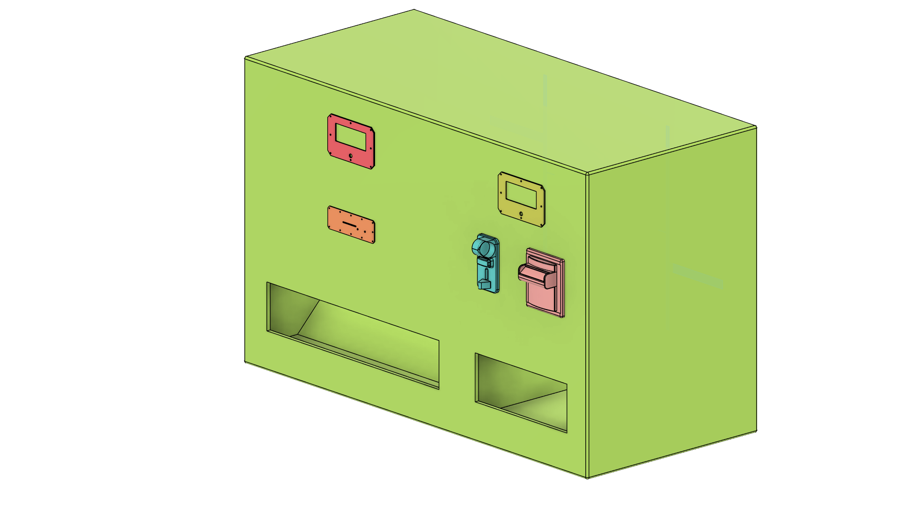
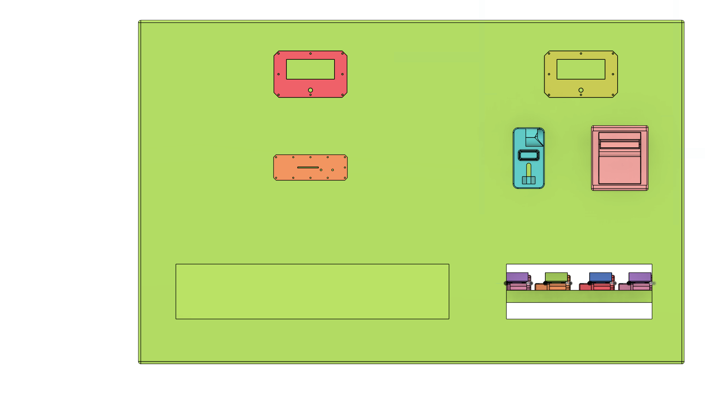
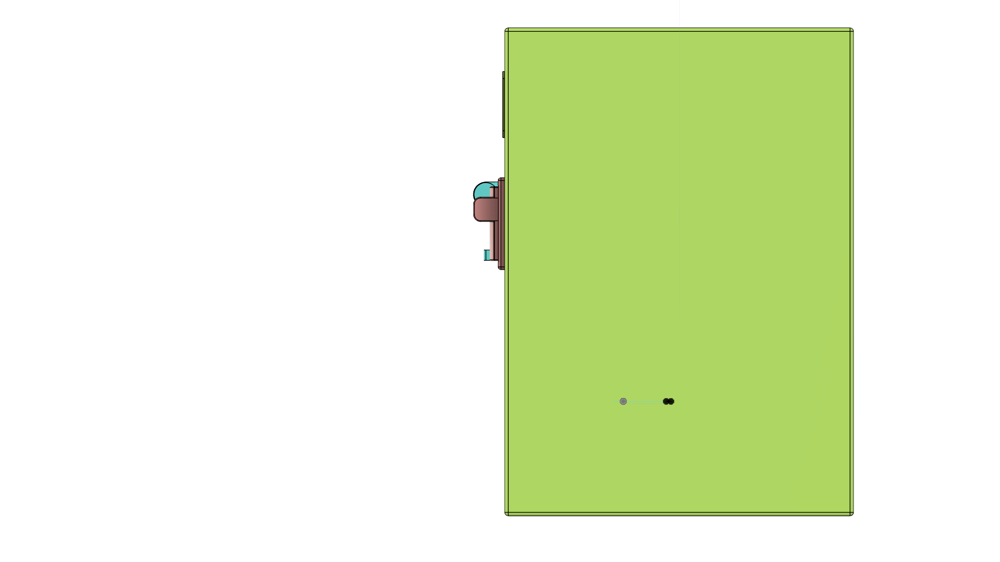

# IoT Chits Exchanger

<div align="center">
  [](https://github.com/qppd/Chits-Exchanger/releases)
  [](https://opensource.org/licenses/MIT)
  [](https://www.espressif.com/en/products/socs/esp32)
  [](https://www.arduino.cc/)
  [](https://www.raspberrypi.org/)
  [](https://www.python.org/)
</div>

---

## 📋 Table of Contents

- [Quick Start](#-quick-start)
- [Project Overview](#-project-overview)
- [File Structure](#-file-structure)
- [Raspberry Pi Slave System](#-raspberry-pi-slave-system)
- [Serial Communication Protocol](#-serial-communication-protocol)
- [Complete Testing Guide](#-complete-testing-guide)
- [Auto-Dispense System](#-auto-dispense-system)
- [System Architecture](#-system-architecture)
- [Key Features](#-key-features)
- [Hardware Requirements](#-hardware-requirements)
- [Installation Guide](#-installation-guide)
- [Configuration](#-configuration)
- [Usage & Workflow](#-usage--workflow)
- [Pin Configuration](#-pin-configuration)
- [Testing & Validation](#-testing--validation)
- [Troubleshooting](#-troubleshooting)
- [Software Architecture](#-software-architecture)
- [API Reference](#-api-reference)
- [3D Models & Manufacturing](#-3d-models--manufacturing)
- [Development Progress](#-development-progress)
- [Version History](#-version-history)
- [Contributing](#-contributing)
- [License & Support](#-license--support)

---

## 🚀 Quick Start

### For Experienced Users (5 minutes)

```bash
# 1. Clone repository
git clone https://github.com/qppd/Chits-Exchanger.git
cd Chits-Exchanger

# 2. Install dependencies
pip3 install -r source/rpi/yolo/requirements.txt
sudo apt-get install pigpio python3-pigpio && sudo pigpiod

# 3. Upload ESP32 firmware
# - Open Arduino IDE → File → Open → source/esp32/CoinExchanger/CoinExchanger.ino
# - Select Board: "ESP32 Dev Module" → Upload

# 4. Configure and run
cd source/rpi/yolo
python3 yolo_detect.py --model chit_model.pt --esp32_port /dev/ttyUSB0
```

### For New Users
👉 See **[Installation Guide](#-installation-guide)** section for detailed step-by-step instructions.

---

## 📖 Project Overview

The **IoT Chits Exchanger** is an intelligent, dual-platform automated currency exchange system that enables:

- **Bidirectional Currency Conversion**: Convert between physical currency (coins/bills) and digital chits/tokens
- **AI-Powered Recognition**: YOLOv11 object detection for accurate chit denomination identification
- **Automated Dispensing**: Precision servo-controlled chit and coin distribution
- **Real-time User Interface**: LCD display with tactile button controls
- **Network Connectivity**: Serial communication between ESP32 and Raspberry Pi platforms

### Core Functionality

#### Platform 1: Coins → Chits (ESP32)
- Real-time detection and validation of coins
- Smart dispensing system with precise servo control
- Interactive LCD display with user guidance
- Audio feedback with piezo buzzer
- Automatic denomination calculation

#### Platform 2: Chits → Coins (Raspberry Pi + AI)
- YOLOv11-powered chit detection and classification
- Automatic chit insertion via servo mechanism
- Professional ALLAN coin hopper integration
- Multi-denomination coin dispensing
- Advanced computer vision processing

---

## 📁 File Structure

```
Chits-Exchanger/
├── README.md                           # Complete project documentation
├── diagram/                            # System diagrams
│   ├── Peso_Bill_To_Chit.png          # Peso to chit wiring diagram
│   ├── Peso_Bill_To_Chit.fzz          # Fritzing circuit diagram
│   └── Chit_To_Peso.png               # Chit to peso wiring diagram
├── ml/                                 # Machine learning models
│   ├── my_model.pt                     # Trained YOLO model
│   └── training/                       # Training data and results
│       ├── args.yaml                   # Training configuration
│       ├── results.csv                 # Training metrics
│       └── weights/                    # Model checkpoints
│           ├── best.pt                 # Best performing model
│           └── last.pt                 # Latest model checkpoint
├── model/                              # 3D models and prints
│   ├── ALLAN_COINSLOT.f3d             # Coin slot 3D model
│   ├── CE3V3SE_Chit_Acceptor_Front.gcode    # Chit acceptor front
│   ├── CE3V3SE_Chit_Acceptor_Hand.gcode     # Chit acceptor hand
│   ├── CE3V3SE_Chit_Dispenser_Servo_Mount.gcode  # Servo mount
│   ├── CE3V3SE_Chit_Dispenser_Servo_Roller.gcode # Servo roller
│   ├── CE3V3SE_Chit_Exchanger_Hopper_Coin_Pusher_Extension.gcode
│   ├── CE3V3SE_Chit_Lcd_Mount.gcode           # LCD mount
│   ├── CE3V3SE_ESP32-CAM_-_ESP32-CAM-MB_Case.gcode # ESP32-CAM case
│   ├── QPPD4 v29.f3d                    # Main chassis design
│   └── TB74.f3d                         # Additional components
└── source/                             # Source code directory
    ├── esp32/                          # ESP32 platform code
    │   ├── ChitExchanger/              # Chit-to-coin exchanger
    │   │   ├── ChitExchanger.ino       # Main Arduino sketch
    │   │   ├── BILL_ACCEPTOR.cpp/h     # Bill acceptor module
    │   │   ├── COIN_SLOT.cpp/h         # Coin slot interface
    │   │   ├── I2C_LCD.cpp/h           # LCD display driver
    │   │   ├── PIEZO_BUZZER.cpp/h      # Audio feedback
    │   │   ├── SERVO_DISPENSER.cpp/h   # Servo control
    │   │   ├── TACTILE_BUTTON.cpp/h    # Button interface
    │   │   └── PIN_CONFIGURATION.h     # Pin definitions
    │   └── CoinExchanger/              # Coin-to-chit exchanger
    │       ├── CoinExchanger.ino       # Main Arduino sketch
    │       ├── COIN_HOPPER.cpp/h       # Coin hopper control
    │       ├── SOLID_STATE_RELAY.cpp/h # Relay switching
    │       └── PIN_CONFIGURATION.h     # Pin definitions
    ├── esp32cam/                       # ESP32-CAM code
    │   └── IPCamera/                   # IP camera streaming
    │       └── IPCamera.ino            # Camera firmware
    └── rpi/                            # Raspberry Pi code
        ├── test/                       # Testing utilities
        │   ├── all_tester.py           # Comprehensive testing
        │   ├── button_tester.py        # Button testing
        │   ├── esp32_serial_tester.py  # Serial communication test
        │   ├── ir_sensor_tester.py     # IR sensor test
        │   ├── lcd_tester.py           # LCD display test
        │   ├── relay_tester.py         # Relay testing
        │   ├── serial_auto_dispense_test.py # Auto-dispense test
        │   └── servo_tester.py         # Servo testing
        └── yolo/                       # AI detection system
            ├── start_detection_system.py    # Main detection script
            ├── yolo_detect_threaded.py      # Threaded detection
            ├── yolo_detect.py               # Core detection logic
            ├── yolo_detect2.py              # Alternative detection
            ├── esp32_comm.py                # ESP32 communication
            ├── benchmark_inference.py       # Performance benchmarking
            ├── test_auto_detection.py       # Auto-detection testing
            ├── test_esp32_slave.py          # ESP32 integration test
            ├── test_lcd_states.py           # LCD state testing
            ├── requirements.txt             # Python dependencies
            ├── run_yolo.sh                 # Run script
            ├── start.sh                    # Startup script
            ├── install_lcd.sh              # LCD installation
            ├── chit_model.pt               # Trained chit detection model
            ├── yolo11n.pt                  # YOLOv11 base model
            ├── yolo11n.torchscript         # TorchScript model
            ├── __pycache__/                # Python cache
            ├── runs/                       # Detection results
            │   └── detect/
            │       └── predict/            # Prediction outputs
            ├── chit_model_ncnn_model/      # NCNN optimized model
            │   ├── metadata.yaml
            │   └── model_ncnn.py
            ├── my_model_ncnn_model/        # Custom NCNN model
            │   ├── metadata.yaml
            │   └── model_ncnn.py
            └── yolo11n_ncnn_model/         # YOLOv11 NCNN model
                ├── metadata.yaml
                ├── model_ncnn.py
                └── model.ncnn.param
```

### Directory Descriptions

- **`diagram/`**: System architecture diagrams and circuit schematics
- **`ml/`**: Machine learning models and training artifacts
- **`model/`**: 3D CAD models and G-code files for 3D printing
- **`source/esp32/`**: ESP32 microcontroller firmware (Arduino sketches)
- **`source/esp32cam/`**: ESP32-CAM camera streaming firmware
- **`source/rpi/test/`**: Testing utilities for hardware validation
- **`source/rpi/yolo/`**: AI-powered chit detection system with YOLOv11

---

## 🔗 Raspberry Pi Slave System

### System Architecture

The Raspberry Pi acts as a slave system that receives commands from the ESP32 master controller and handles:

- IR Sensor Detection - Detects when a chit is inserted
- YOLO Chit Recognition - Identifies chit denomination (5, 10, 20, 50 pesos)
- LCD Display - Shows status messages on 20x4 I2C LCD
- Servo Control - Dispenses chit after coin exchange

### Hardware Configuration

#### GPIO Pins (BCM Numbering)
- IR Sensor: GPIO17
- Servo Motor: GPIO22
  - Initial Angle: 39 degrees
  - Release Angle: 90 degrees

#### I2C LCD
- Address: 0x27
- Size: 20x4 characters

#### Serial Connection
- Port: /dev/serial0
- Baud Rate: 115200
- Connected to: ESP32 TX/RX pins

### Command Protocol

#### Commands Received from ESP32

| Command | Description | Response |
|---------|-------------|----------|
| `CHECK_IR` | Check if IR sensor detects chit | `IR_DETECTED` or `IR_CLEAR` |
| `DETECT_CHIT` | Run YOLO detection | `CHIT_5`, `CHIT_10`, `CHIT_20`, `CHIT_50`, or `CHIT_UNKNOWN` |
| `DISPLAY:<message>` | Display message on LCD (lines separated by \|) | `DISPLAY_OK` |
| `DISPENSE_CHIT` | Release chit via servo | `DISPENSE_COMPLETE` |
| `PING` | Check if slave is alive | `PONG` |
| `RESET` | Reset to initial state | `RESET_OK` |

#### Responses Sent to ESP32

| Response | Description |
|----------|-------------|
| `SLAVE_READY` | System initialized and ready |
| `IR_DETECTED` | Chit detected by IR sensor |
| `IR_CLEAR` | No chit detected |
| `CHIT_5` | Detected 5 peso chit |
| `CHIT_10` | Detected 10 peso chit |
| `CHIT_20` | Detected 20 peso chit |
| `CHIT_50` | Detected 50 peso chit |
| `CHIT_UNKNOWN` | Could not identify chit |
| `DISPENSE_COMPLETE` | Chit dispensed successfully |
| `DISPLAY_OK` | LCD updated |
| `ERROR:<message>` | Error occurred |
| `SLAVE_SHUTDOWN` | System shutting down |

### Raspberry Pi Slave Installation

#### Prerequisites

```bash
# Update system
sudo apt-get update
sudo apt-get upgrade

# Install pigpio daemon (for servo control)
sudo apt-get install pigpio python3-pigpio
sudo systemctl enable pigpiod
sudo systemctl start pigpiod

# Install Python dependencies
pip3 install pyserial
pip3 install RPi.GPIO
pip3 install smbus2
pip3 install opencv-python
pip3 install ultralytics

# Enable serial port (disable console)
sudo raspi-config
# Navigate to: Interface Options -> Serial Port
# Disable login shell over serial: NO
# Enable serial port hardware: YES
# Reboot
```

#### Model Setup

Place your trained YOLO model at:
```
/home/pi/Desktop/PROJECTS/Chits-Exchanger/source/rpi/yolo/chit_model.pt
```

Or update `MODEL_PATH` in `esp32_comm.py` to your model location.

### Usage

#### Start the Slave System

```bash
cd /home/pi/Desktop/PROJECTS/Chits-Exchanger/source/rpi/yolo
python3 esp32_comm.py
```

#### Expected Output

```
==================================================
ESP32 Chit Slave Controller Initializing...
==================================================
[LCD] Initializing...
[LCD] ✓ Initialized
[IR] Initializing...
[IR] ✓ Initialized
[SERVO] Initializing...
[SERVO] ✓ Initialized
[YOLO] Initializing...
[YOLO] Loading model: /home/pi/.../chit_model.pt
[YOLO] Model loaded successfully. Classes: {0: '5', 1: '10', 2: '20', 3: '50'}
[YOLO] ✓ Model loaded
[CAMERA] Opened camera index 0
[CAMERA] ✓ Opened
[SERIAL] Initializing...
[SERIAL] ✓ Connected on /dev/serial0 @ 115200 baud

==================================================
✓ ALL SYSTEMS INITIALIZED
==================================================

[TX → ESP32] SLAVE_READY
[SYSTEM] Slave controller running. Listening for ESP32 commands...
[SYSTEM] Press Ctrl+C to shutdown
```

#### Run as Systemd Service (Auto-start on boot)

Create service file:

```bash
sudo nano /etc/systemd/system/chit-slave.service
```

Add content:

```ini
[Unit]
Description=Chit Exchanger Slave System
After=network.target pigpiod.service

[Service]
Type=simple
User=pi
WorkingDirectory=/home/pi/Desktop/PROJECTS/Chits-Exchanger/source/rpi/yolo
ExecStart=/usr/bin/python3 /home/pi/Desktop/PROJECTS/Chits-Exchanger/source/rpi/yolo/esp32_comm.py
Restart=always
RestartSec=10

[Install]
WantedBy=multi-user.target
```

Enable and start:

```bash
sudo systemctl daemon-reload
sudo systemctl enable chit-slave.service
sudo systemctl start chit-slave.service

# Check status
sudo systemctl status chit-slave.service

# View logs
journalctl -u chit-slave.service -f
```

### Transaction Workflow Example

#### Complete Transaction Flow

1. **ESP32 Sends**: `CHECK_IR`
   - **RPi Response**: `IR_DETECTED`

2. **ESP32 Sends**: `DETECT_CHIT`
   - **RPi**: Captures frames, runs YOLO
   - **RPi Response**: `CHIT_50` (or other denomination)

3. **ESP32 Sends**: `DISPLAY:Chit Detected!|Value: P50|Calculating...|`
   - **RPi**: Updates LCD
   - **RPi Response**: `DISPLAY_OK`

4. **ESP32**: Calculates coin combination, dispenses coins

5. **ESP32 Sends**: `DISPLAY:Dispensing|Complete!|Releasing chit...|`
   - **RPi Response**: `DISPLAY_OK`

6. **ESP32 Sends**: `DISPENSE_CHIT`
   - **RPi**: Servo rotates to release chit
   - **RPi Response**: `DISPENSE_COMPLETE`

7. **ESP32 Sends**: `RESET`
   - **RPi**: Resets to ready state
   - **RPi Response**: `RESET_OK`

### Slave System Configuration

Edit constants in `esp32_comm.py`:

```python
# GPIO Pins
IR_SENSOR_PIN = 17
SERVO_PIN = 22

# Servo Angles
SERVO_INITIAL_ANGLE = 39
SERVO_RELEASE_ANGLE = 90

# LCD
LCD_I2C_ADDR = 0x27

# Serial
SERIAL_PORT = '/dev/serial0'
SERIAL_BAUD = 115200

# YOLO
MODEL_PATH = '/path/to/your/chit_model.pt'
CAMERA_INDEX = 0
DETECTION_TIMEOUT = 5.0
CONFIDENCE_THRESHOLD = 0.6
```

### Troubleshooting Raspberry Pi Slave

#### Serial Communication Issues

```bash
# Check if serial port is available
ls -l /dev/serial0

# Test serial connection
sudo apt-get install minicom
minicom -b 115200 -o -D /dev/serial0
```

#### Camera Issues

```bash
# List available cameras
v4l2-ctl --list-devices

# Test camera
python3 -c "import cv2; cap = cv2.VideoCapture(0); print('Camera OK' if cap.isOpened() else 'Camera Failed'); cap.release()"
```

#### LCD Not Working

```bash
# Check I2C devices
sudo i2cdetect -y 1

# Should show 0x27 (or your LCD address)
```

#### Pigpio Daemon Issues

```bash
# Check if pigpiod is running
sudo systemctl status pigpiod

# Restart if needed
sudo systemctl restart pigpiod
```

### Testing Individual Components

```bash
# Test IR Sensor
python3 /home/pi/Desktop/PROJECTS/Chits-Exchanger/source/rpi/test/ir_sensor_tester.py

# Test Servo
python3 /home/pi/Desktop/PROJECTS/Chits-Exchanger/source/rpi/test/servo_tester.py

# Test LCD
python3 /home/pi/Desktop/PROJECTS/Chits-Exchanger/source/rpi/test/lcd_tester.py
```

---

## 📡 Serial Communication Protocol

### System Architecture

```
┌─────────────────────────────────────────┐
│   Raspberry Pi (MASTER)                 │
│   - yolo_detect.py                      │
│   - IR Sensor monitoring                │
│   - YOLO chit detection                 │
│   - Servo chit dispenser                │
│   - LCD display                         │
└──────────────┬──────────────────────────┘
               │
               │ Serial (115200 baud)
               │ /dev/ttyUSB0
               │
┌──────────────▼──────────────────────────┐
│   ESP32 (SLAVE)                         │
│   - CoinExchanger.ino                   │
│   - 3x Coin Hoppers (5, 10, 20 PHP)     │
│   - Coin dispensing logic               │
│   - LCD display                         │
└─────────────────────────────────────────┘
```

### Communication Flow

#### Initialization

1. **ESP32** starts up and sends:
   - `SLAVE_READY` - Announces it's ready to receive commands

2. **RPi** starts up and begins monitoring IR sensor

#### Normal Operation Flow

1. **RPi** monitors IR sensor continuously
2. When chit inserted:
   - **RPi** sends: `IR_DETECTED`
3. **RPi** runs YOLO detection
4. When chit identified:
   - **RPi** sends: `CHIT_DETECTED:50` (example: 50 peso chit)
5. **RPi** releases chit via servo
   - **RPi** sends: `CHIT_RELEASED`
6. **RPi** triggers auto-dispensing
   - **RPi** sends: `AUTO_DISPENSE:50`
7. **ESP32** calculates coin combination and dispenses
8. When complete:
   - **ESP32** sends: `DISPENSING_COMPLETE`
9. **RPi** updates LCD to "Ready" state

#### Error Handling

- If detection times out:
  - **RPi** sends: `DETECTION_TIMEOUT`
  - **ESP32** resets to idle state

- If ESP32 is busy:
  - **ESP32** sends: `ERROR:SYSTEM_BUSY`
  - **RPi** waits and retries

- If invalid value received:
  - **ESP32** sends: `ERROR:INVALID_VALUE`

#### Shutdown

- When shutting down:
  - **RPi** sends: `SYSTEM_SHUTDOWN`
  - **ESP32** acknowledges and enters standby mode

### Command Reference

#### Commands FROM RPi TO ESP32 (Master → Slave)

| Command | Format | Description | ESP32 Action |
|---------|--------|-------------|--------------|
| `IR_DETECTED` | `IR_DETECTED` | IR sensor detected chit | Informational only |
| `CHIT_DETECTED` | `CHIT_DETECTED:50` | Chit value identified | Triggers calculation and dispensing |
| `AUTO_DISPENSE` | `AUTO_DISPENSE:50` | Auto-dispense command | Immediately dispenses coins for value |
| `CHIT_RELEASED` | `CHIT_RELEASED` | Servo released chit | Informational only |
| `DETECTION_TIMEOUT` | `DETECTION_TIMEOUT` | Detection failed | Resets ESP32 to idle |
| `SYSTEM_SHUTDOWN` | `SYSTEM_SHUTDOWN` | RPi shutting down | ESP32 enters standby |

#### Responses FROM ESP32 TO RPi (Slave → Master)

| Response | Format | Description | When Sent |
|----------|--------|-------------|-----------|
| `SLAVE_READY` | `SLAVE_READY` | ESP32 is ready | At startup |
| `DISPENSING_COMPLETE` | `DISPENSING_COMPLETE` | Coins dispensed successfully | After dispensing completes |
| `ERROR:SYSTEM_BUSY` | `ERROR:SYSTEM_BUSY` | ESP32 busy, cannot accept command | When already dispensing |
| `ERROR:INVALID_VALUE` | `ERROR:INVALID_VALUE` | Invalid chit value received | When value not 5/10/20/50 |

### Valid Chit Values

- `5` - 5 peso chit
- `10` - 10 peso chit
- `20` - 20 peso chit
- `50` - 50 peso chit

### Serial Port Settings

- **Baud Rate**: 115200
- **Data Bits**: 8
- **Parity**: None
- **Stop Bits**: 1
- **Flow Control**: None (DTR/RTS disabled to prevent auto-reset)
- **Terminator**: Newline (`\n`)

### Example Communication Session

```
[ESP32 startup]
ESP32 → RPi: SLAVE_READY

[User inserts 50 peso chit]
RPi → ESP32: IR_DETECTED
[RPi runs YOLO detection for 3-5 seconds]
RPi → ESP32: CHIT_DETECTED:50
[RPi moves servo to release chit]
RPi → ESP32: CHIT_RELEASED
[RPi triggers auto-dispensing]
RPi → ESP32: AUTO_DISPENSE:50

[ESP32 calculates: 2x20PHP + 1x10PHP]
[ESP32 dispenses coins from hoppers]
[After ~10-15 seconds]
ESP32 → RPi: DISPENSING_COMPLETE

[System ready for next transaction]
```

### Timing Considerations

- **IR Detection**: Continuous monitoring, ~10ms polling
- **YOLO Detection**: 3-5 seconds per chit
- **Servo Release**: 2 seconds movement
- **Auto-Dispense**: 10-15 seconds depending on coin count
- **Serial Timeout**: 1 second for writes, 10ms for reads (non-blocking)

### Error Recovery

1. **Communication timeout**: RPi continues operation, ESP32 waits
2. **Invalid command**: ESP32 logs error, ignores command
3. **Busy state**: ESP32 responds with ERROR, RPi waits and retries
4. **Detection failure**: RPi sends DETECTION_TIMEOUT, both reset

### Notes

- **RPi is MASTER**: Initiates all operations based on sensor input
- **ESP32 is SLAVE**: Responds to commands, executes dispensing
- **Non-blocking**: RPi uses non-blocking serial reads for responsiveness
- **One transaction at a time**: ESP32 rejects commands if busy
- **Auto-dispensing**: Default behavior, no user selection required

---

## 🧪 Complete Testing Guide

### System Overview

The system consists of two main components:
1. **RPi with YOLO Detection** (`yolo_detect.py`) - Detects chit denominations
2. **ESP32 Coin Exchanger** (`CoinExchanger.ino`) - Dispenses coins based on detected value

### Hardware Testing Configuration

#### Coin Hoppers (ESP32)
- **Hopper 1 (5 PHP coins)**
  - Pulse Detection: GPIO4
  - SSR Control: GPIO26
  
- **Hopper 2 (10 PHP coins)**
  - Pulse Detection: GPIO18
  - SSR Control: GPIO25
  
- **Hopper 3 (20 PHP coins)**
  - Pulse Detection: GPIO19
  - SSR Control: GPIO33

#### Dispensing Logic

| Chit Value | Hopper 1 (5₱) | Hopper 2 (10₱) | Hopper 3 (20₱) | Total |
|------------|---------------|----------------|----------------|-------|
| 5 PHP      | 1 coin        | -              | -              | 5₱    |
| 10 PHP     | -             | 1 coin         | -              | 10₱   |
| 20 PHP     | -             | -              | 1 coin         | 20₱   |
| 50 PHP     | -             | 1 coin         | 2 coins        | 50₱   |

### Testing Procedures

#### Test 1: Individual Hopper Components

Test each hopper's pulse detection and SSR relay independently.

##### Test Pulse Detection
```bash
# Connect to ESP32 Serial Monitor (115200 baud)

# Test Hopper 1 pulse reading
test_pulse 1

# Test Hopper 2 pulse reading
test_pulse 2

# Test Hopper 3 pulse reading
test_pulse 3
```

**Expected Result:** 
- Drop coins manually into the hopper
- System should detect and count each coin pulse
- Display: `✅ PULSE detected! Coin #X | Rate: X.XX coins/sec`

##### Test SSR Relay Control
```bash
# Test Hopper 1 relay
test_relay 1 on    # Turn ON relay (hopper motor runs)
test_relay 1 off   # Turn OFF relay (hopper motor stops)

# Test Hopper 2 relay
test_relay 2 on
test_relay 2 off

# Test Hopper 3 relay
test_relay 3 on
test_relay 3 off
```

**Expected Result:**
- ON: Hopper motor starts, LED indicator lights
- OFF: Hopper motor stops, LED indicator off

#### Test 2: Individual Hopper Dispensing

Test complete dispensing cycle with pulse counting for each hopper.

```bash
# Dispense 3 coins from Hopper 1 (5 peso)
test_hopper 1 3

# Dispense 5 coins from Hopper 2 (10 peso)
test_hopper 2 5

# Dispense 2 coins from Hopper 3 (20 peso)
test_hopper 3 2
```

**Expected Result:**
```
=== HOPPER DISPENSING TEST ===
Hopper: 1
Coin Value: 5 PHP
Coins to Dispense: 3
Total Amount: 15 PHP
Pulse GPIO: 4
SSR GPIO: 26
==============================
🟢 Turning ON SSR relay...
🪙 Starting coin dispensing...
Progress: 1/3 coins (5/15 PHP) | Rate: 2.50 coins/sec
Progress: 2/3 coins (10/15 PHP) | Rate: 2.45 coins/sec
Progress: 3/3 coins (15/15 PHP) | Rate: 2.48 coins/sec
🔴 Turning OFF SSR relay...

📊 TEST RESULTS:
  Target Coins: 3
  Dispensed Coins: 3
  Target Amount: 15 PHP
  Dispensed Amount: 15 PHP
  ✅ TEST PASSED!
```

#### Test 3: Auto-Dispense Logic

Simulate the full AUTO_DISPENSE flow without RPi.

```bash
# Test 5 peso dispense
test_auto 5

# Test 10 peso dispense
test_auto 10

# Test 20 peso dispense
test_auto 20

# Test 50 peso dispense (most complex - uses 2 hoppers)
test_auto 50
```

**Expected Result for `test_auto 50`:**
```
========================================
🧪 AUTO-DISPENSE TEST
Simulating detection of P50 chit
========================================

=== Dispensing Plan ===
5 PHP coins: 0 (0 PHP)
10 PHP coins: 1 (10 PHP)
20 PHP coins: 2 (40 PHP)
Total value: P50
======================

=== Starting Dispensing ===
Dispensing 2 x 20 PHP coins from Hopper 3
Enabling SSR for Hopper 3 (GPIO33)
[Coins dispensed...]
Disabling SSR for Hopper 3
Dispensed: 2/2 coins (40 PHP)

Dispensing 1 x 10 PHP coins from Hopper 2
Enabling SSR for Hopper 2 (GPIO25)
[Coins dispensed...]
Disabling SSR for Hopper 2
Dispensed: 1/1 coins (10 PHP)

=== Dispensing Complete ===

Transaction complete!
DISPENSING_COMPLETE:50
```

#### Test 4: Serial Communication

Test the serial communication between RPi and ESP32.

##### From RPi Terminal

```bash
# Send AUTO_DISPENSE command via serial
echo "AUTO_DISPENSE:20" > /dev/ttyUSB0

# Monitor responses
cat /dev/ttyUSB0
```

##### From ESP32 Serial Monitor

Send commands directly:
```bash
AUTO_DISPENSE:50
```

**Expected Flow:**
1. ESP32 receives: `AUTO_DISPENSE:50`
2. ESP32 displays on LCD: Auto dispensing plan
3. ESP32 enables SSR for Hopper 3
4. ESP32 dispenses 2x 20 peso coins
5. ESP32 disables SSR for Hopper 3
6. ESP32 enables SSR for Hopper 2
7. ESP32 dispenses 1x 10 peso coin
8. ESP32 disables SSR for Hopper 2
9. ESP32 sends: `DISPENSING_COMPLETE:50`

#### Test 5: Complete System Integration

Test the full system flow from YOLO detection to coin dispensing.

##### Setup
1. Connect ESP32 to RPi via USB (typically `/dev/ttyUSB0`)
2. Upload `CoinExchanger.ino` to ESP32
3. Start YOLO detection on RPi:

```bash
cd /home/admin/Chits-Exchanger/source/rpi/yolo/
python3 yolo_detect.py --model ../../ml/my_model.pt --esp32_port /dev/ttyUSB0 --camera 0
```

##### Test Procedure

1. **Insert Chit into Acceptor**
   - IR sensor detects chit presence
   - RPi displays: "IR DETECTED! Scanning chit..."
   - YOLO starts analyzing the chit

2. **YOLO Detection Phase**
   - Camera captures chit image
   - YOLO identifies denomination (5, 10, 20, or 50)
   - Confidence level calculated
   - Best detection displayed on screen

3. **Chit Release**
   - Servo releases chit after successful detection
   - RPi sends: `AUTO_DISPENSE:<value>`

4. **ESP32 Auto-Dispensing**
   - ESP32 receives command
   - Calculates coin combination
   - Displays plan on LCD
   - Enables SSR for required hoppers
   - Dispenses coins with pulse counting
   - Disables SSR after dispensing
   - Sends: `DISPENSING_COMPLETE:<value>`

5. **Completion**
   - RPi displays success message
   - System returns to idle state
   - Ready for next chit

##### Expected Console Output (RPi)

```
============================================================
🔍 IR SENSOR TRIGGERED - CHIT DETECTED
============================================================
   Starting YOLO detection...
   Timeout: 10 seconds
============================================================

💰 Detected: ₱50 chit | Conf: 95% | Time: 2s

============================================================
🎉 DETECTION COMPLETE
============================================================
   Detected Value: ₱50
   Confidence: 95%
   Detection Time: 2.34s
============================================================

🔓 Releasing chit via servo...
✅ Chit ₱50 released successfully

============================================================
🪙 AUTO-DISPENSING TRIGGERED
============================================================
   Sending to ESP32: AUTO_DISPENSE:50
   Expected dispensing:
     - 2 x 20 PHP coins (Hopper 3)
     - 1 x 10 PHP coin (Hopper 2)
============================================================

✅ Sent to ESP32: AUTO_DISPENSE:50

📨 ESP32: DISPENSING_COMPLETE:50

Waiting for next chit...
```

##### Expected Console Output (ESP32)

```
========================================
🎯 AUTO_DISPENSE received: P50
========================================

=== Auto Dispensing Plan ===
5 PHP coins: 0
10 PHP coins: 1
20 PHP coins: 2
Total value: P50
======================

🚀 Starting automatic coin dispensing...

=== Starting Dispensing ===

Dispensing 2 x 20 PHP coins from Hopper 3
Enabling SSR for Hopper 3 (GPIO33)
Dispensed: 2/2 coins (40 PHP)
Disabling SSR for Hopper 3

Dispensing 1 x 10 PHP coins from Hopper 2
Enabling SSR for Hopper 2 (GPIO25)
Dispensed: 1/1 coins (10 PHP)
Disabling SSR for Hopper 2

=== Dispensing Complete ===

Transaction complete!
DISPENSING_COMPLETE:50
```

### Common Testing Issues

#### Issue: Pulse Not Detected

**Symptoms:** `test_pulse` shows no pulses when coins are dropped

**Solutions:**
1. Check GPIO pin connections
2. Verify hopper pulse sensor wiring
3. Test with multimeter: pulse pin should go LOW when coin passes
4. Adjust debounce timing in code if needed

#### Issue: SSR Not Activating

**Symptoms:** `test_relay on` doesn't turn on hopper motor

**Solutions:**
1. Check SSR power connections (3.3V, GND, GPIO)
2. Verify SSR LED indicator
3. Test SSR with multimeter
4. Check hopper motor power supply (12V/24V)

#### Issue: Serial Communication Failure

**Symptoms:** ESP32 not receiving AUTO_DISPENSE commands

**Solutions:**
1. Check USB cable connection
2. Verify serial port: `ls /dev/ttyUSB*`
3. Check baud rate (must be 115200)
4. Grant permissions: `sudo usermod -a -G dialout $USER`
5. Close other serial monitors
6. Restart both ESP32 and RPi

#### Issue: Incorrect Coin Count

**Symptoms:** Dispensed coins don't match requested amount

**Solutions:**
1. Clean coin hopper sensors
2. Verify coins are correct denomination
3. Check for coin jams
4. Adjust pulse detection sensitivity
5. Verify hopper motor speed (may be too fast/slow)

#### Issue: System Busy Error

**Symptoms:** ESP32 shows "SYSTEM BUSY" message

**Solutions:**
1. Wait for current operation to complete
2. Check if hopper is jammed
3. Reset ESP32 if stuck
4. Check SSR state (should be OFF when idle)

### Test Commands Reference

#### ESP32 Serial Commands

```bash
# Testing Commands
help                    # Show all available commands
test_pulse 1            # Test pulse detection on hopper 1
test_relay 1 on         # Turn on SSR for hopper 1
test_relay 1 off        # Turn off SSR for hopper 1
test_hopper 1 5         # Dispense 5 coins from hopper 1
test_auto 50            # Simulate auto-dispense for 50 peso
test_all                # Run comprehensive hardware test

# Simulation Commands
test_chit 50            # Simulate manual chit detection (with button UI)

# RPi Commands (sent via serial)
AUTO_DISPENSE:5         # Auto-dispense 5 peso
AUTO_DISPENSE:10        # Auto-dispense 10 peso
AUTO_DISPENSE:20        # Auto-dispense 20 peso
AUTO_DISPENSE:50        # Auto-dispense 50 peso
IR_DETECTED             # IR sensor triggered
DETECTION_TIMEOUT       # Detection timeout
```

### Performance Metrics

#### Target Performance

- **Detection Time:** < 3 seconds
- **Dispensing Time per Coin:** ~0.4 seconds (2.5 coins/sec)
- **Total Transaction Time:**
  - 5 PHP: ~5 seconds
  - 10 PHP: ~5 seconds
  - 20 PHP: ~5 seconds
  - 50 PHP: ~7 seconds (3 coins)
  
#### Accuracy Requirements

- **YOLO Detection Confidence:** > 50%
- **Pulse Detection Accuracy:** 100% (all coins counted)
- **SSR Reliability:** 100% (must turn on/off correctly)
- **Serial Communication:** 100% (no dropped messages)

### Maintenance

#### Daily Checks
- Test all 3 hoppers with `test_all`
- Verify serial communication
- Check coin levels in hoppers
- Clean IR sensor and camera

#### Weekly Checks
- Test complete system integration
- Verify pulse detection on all hoppers
- Check SSR relay operation
- Inspect wiring connections

#### Monthly Checks
- Clean coin sensors
- Lubricate hopper mechanisms
- Test with all denominations (5, 10, 20, 50)
- Verify YOLO model accuracy

---

## 🔄 Auto-Dispense System

### Dual-Platform Overview

```
┌─────────────────────────────────────────────────────────────────┐
│                    COMPLETE SYSTEM ARCHITECTURE                  │
├─────────────────────────────────────────────────────────────────┤
│                                                                 │
│  ┌──────────────────────────┐  ┌──────────────────────────┐   │
│  │   ESP32 Platform         │  │   Raspberry Pi Platform   │   │
│  │   (Coin Processing)      │  │   (Chit Processing)      │   │
│  ├──────────────────────────┤  ├──────────────────────────┤   │
│  │ • Coin Slot              │  │ • IR Sensor              │   │
│  │ • 3x Coin Hoppers        │  │ • YOLOv11 AI System      │   │
│  │ • LCD Display (20x4)     │  │ • Camera/Streaming       │   │
│  │ • Button Interface       │  │ • Chit Servo            │   │
│  │ • 3x SSR Relays         │  │ • ALLAN Hoppers (×3)     │   │
│  │ • Serial Communication   │  │ • LCD Display           │   │
│  │ • Pulse Detection        │  │ • Serial Communication  │   │
│  └──────────────────────────┘  └──────────────────────────┘   │
│           ▲                              ▲                      │
│           └──────────────────┬───────────┘                      │
│                              │                                  │
│              ← Serial Communication →                          │
│                                                                 │
└─────────────────────────────────────────────────────────────────┘
```

### Signal Flow

```
IR Detection → YOLO Processing → Chit Classification → 
Serial Command → ESP32 Processing → Coin Dispensing → 
Serial Response → LCD Update → System Reset
```

### Communication Protocol

**ESP32 → Raspberry Pi:**
- `ESP32_READY` - System initialized and ready
- `DISPENSING_COMPLETE` - Coin dispensing finished
- `ERROR:SYSTEM_BUSY` - Cannot accept command (busy)
- `ERROR:INVALID_VALUE` - Invalid chit value received

**Raspberry Pi → ESP32:**
- `IR_DETECTED` - IR sensor detected chit
- `CHIT_DETECTED:50` - Chit value identified
- `AUTO_DISPENSE:50` - Trigger coin dispensing
- `CHIT_RELEASED` - Servo released chit
- `DETECTION_TIMEOUT` - Detection failed
- `SYSTEM_SHUTDOWN` - System shutting down

---

## ✨ Key Features

## ✨ Key Features

### Automated Processing
- ✅ **Real-time Detection**: Instant chit recognition with IR sensors
- ✅ **State Machine Workflow**: Organized process flow with error handling
- ✅ **Automatic Calculation**: Optimal coin combination computation
- ✅ **Remainder Handling**: Intelligent management of non-dispensable amounts

### Hardware Integration
- ✅ **Professional Hoppers**: ALLAN coin hoppers with pulse counting
- ✅ **Real-time Feedback**: LCD display with live status updates
- ✅ **Audio Notifications**: Contextual sound feedback for transactions
- ✅ **Serial Communication**: Reliable ESP32 ↔ RPi synchronization

### AI & Vision
- ✅ **99.5% Accuracy**: Custom-trained YOLOv11 model for chit recognition
- ✅ **Sub-Second Processing**: Real-time inference on Raspberry Pi
- ✅ **4 Denominations**: Support for 5, 10, 20, 50 peso chits
- ✅ **Camera Integration**: USB webcam with continuous detection

### Connectivity & Control
- ✅ **Serial Protocol**: Reliable inter-system messaging
- ✅ **Remote Monitoring**: Real-time system status tracking
- ✅ **Configuration Flexibility**: Easily adjustable parameters
- ✅ **Error Recovery**: Automatic timeout and retry mechanisms

---

## 💻 Hardware Requirements

### ESP32 Platform (Coin Processing)

| Component | Specification | Qty | Purpose |
|-----------|---------------|-----|---------|
| **Microcontroller** | ESP32 DevKit | 1 | Main control unit |
| **Coin Hoppers** | ALLAN CH-926 Series | 3 | Coin dispensing (5, 10, 20 PHP) |
| **SSR Relays** | 3A rated | 3 | Hopper power control |
| **LCD Display** | 20x4 I2C | 1 | User interface |
| **Push Button** | 12mm | 1 | User input |
| **Piezo Buzzer** | 5V Active | 1 | Audio feedback |

### Raspberry Pi Platform (Chit Processing)

| Component | Specification | Qty | Purpose |
|-----------|---------------|-----|---------|
| **SBC** | Raspberry Pi 4B (4GB+) | 1 | AI processing |
| **Camera Module** | USB Webcam | 1 | Chit detection |
| **ALLAN Hoppers** | CH-926 Series | 3 | Coin dispensing (5, 10, 20 PHP) |
| **Servo Motor** | High-torque | 1 | Chit insertion |
| **LCD Display** | 20x4 I2C | 1 | User interface |
| **IR Sensor** | Module type | 1 | Chit detection |
| **LED Lighting** | Ring/Strip | 1 | Illumination |
| **Piezo Buzzer** | 5V Active | 1 | Audio feedback |

### Power Requirements

```
12V Rail:  3A minimum (coin hoppers + lighting)
5V Rail:   5A minimum (Raspberry Pi + ESP32 + peripherals)

Total: 12V/3A + 5V/5A
```

---

## 📥 Installation Guide

### Prerequisites

#### Hardware Setup
- [ ] All components from Hardware Requirements section
- [ ] USB-to-Serial adapters (4x for ALLAN hoppers)
- [ ] Jumper wires and breadboard
- [ ] Proper power supplies with current ratings

#### Software Setup
- [ ] Arduino IDE 1.8.19+ installed
- [ ] Python 3.9+ installed on Raspberry Pi
- [ ] Git installed for version control

### Step 1: Prepare Raspberry Pi

```bash
# Update system
sudo apt update && sudo apt upgrade -y

# Install Python and dependencies
sudo apt install -y python3-pip python3-venv git
sudo apt install -y python3-opencv libopencv-dev

# Install pigpio for servo control
sudo apt install -y pigpio python-pigpio python3-pigpio
sudo pigpiod  # Start daemon

# Make pigpio start on boot (optional)
sudo systemctl enable pigpiod

# Clone repository
git clone https://github.com/qppd/Chits-Exchanger.git
cd Chits-Exchanger/source/rpi/yolo

# Install Python dependencies
pip3 install --upgrade pip
pip3 install -r requirements.txt
```

### Step 2: Prepare ESP32

```bash
# 1. Install Arduino IDE
# Download from: https://www.arduino.cc/en/software

# 2. Add ESP32 board support
# File → Preferences → Add Board Manager URL:
# https://dl.espressif.com/dl/package_esp32_index.json

# 3. Install board package
# Tools → Board Manager → Search "esp32" → Install

# 4. Install libraries
# Tools → Manage Libraries:
#   - Adafruit PWM Servo Driver Library
#   - LiquidCrystal I2C
#   - ArduinoJson
```

### Step 3: Upload Firmware

```bash
# ESP32 CoinExchanger
1. Open: source/esp32/CoinExchanger/CoinExchanger.ino
2. Board: ESP32 Dev Module
3. Upload Speed: 921600
4. Click Upload

# ESP32-CAM IPCamera
1. Open: source/esp32cam/IPCamera/IPCamera.ino
2. Board: AI Thinker ESP32-CAM
3. Click Upload
4. Note the IP address from Serial Monitor
```

### Step 4: Hardware Connections

See **[Pin Configuration](#-pin-configuration)** section for detailed wiring.

### Step 5: Configure Network

```bash
# Update ESP32-CAM IP in RPi script
nano source/rpi/yolo/yolo_detect.py
# Edit: img_source = 'http://192.168.1.21/stream'

# Configure WiFi for both devices
# Ensure all devices on same network
```

---

## ⚙️ Configuration

### ESP32 Settings

Edit `source/esp32/CoinExchanger/CoinExchanger.ino`:

```cpp
// WiFi Configuration
#define WIFI_SSID "YourNetwork"
#define WIFI_PASSWORD "YourPassword"
#define RPI_IP "192.168.1.100"
#define RPI_PORT 8888

// Hardware Tuning
#define COIN_DEBOUNCE_MS 50
#define BILL_DEBOUNCE_MS 100
#define SERVO_DISPENSE_DURATION 1050  // milliseconds
```

### Raspberry Pi Settings

Edit `source/rpi/yolo/yolo_detect.py`:

```python
# Camera Configuration
CAMERA_IP = '192.168.1.21'
CAMERA_PORT = 80
STREAM_URL = f'http://{CAMERA_IP}:{CAMERA_PORT}/stream'

# Servo Configuration
SERVO_PIN = 22
SERVO_INITIAL_ANGLE = 39
SERVO_RELEASE_ANGLE = 90

# Serial Configuration
SERIAL_PORT = '/dev/ttyUSB0'
SERIAL_BAUD = 115200

# AI Configuration
YOLO_CONFIDENCE = 0.85
YOLO_MODEL = 'yolo11n.pt'
```

### Hopper Configuration

For ALLAN hoppers, configure denomination mapping:

```bash
# Edit PIN_CONFIGURATION.h
Hopper 1: 5 PHP coins (GPIO 19 pulse, GPIO 26 SSR)
Hopper 2: 10 PHP coins (GPIO 18 pulse, GPIO 25 SSR)
Hopper 3: 20 PHP coins (GPIO 4 pulse, GPIO 33 SSR)
```

---

## 🎮 Usage & Workflow

### Complete Transaction Flow

#### Phase 1: Chit Detection (Raspberry Pi)
```
IR Sensor Triggered
  ↓
YOLO AI Analysis
  ↓
Denomination Identified (5, 10, 20, or 50 peso)
  ↓
Servo Release Mechanism
  ↓
Send "CHIT_DETECTED:<value>" to ESP32
```

#### Phase 2: User Selection (ESP32)
```
LCD: "Chit Detected! Value: P50"
  ↓
User Presses Button
  ↓
LCD: "Select Denom: > P5 coins"
  ↓
Button cycles through 5, 10, 20, Confirm
  ↓
User confirms selection
```

#### Phase 3: Calculation (ESP32)
```
Calculate optimal coin combination
  ↓
LCD: "Plan: 5P:4 10P:1 20P:1"
  ↓
Display confirmation
```

#### Phase 4: Dispensing (ESP32)
```
Activate Hopper 1 (5 PHP) → Count pulses
  ↓
Activate Hopper 2 (10 PHP) → Count pulses
  ↓
Activate Hopper 3 (20 PHP) → Count pulses
  ↓
LCD: "Dispensing... Count: 5/5"
```

#### Phase 5: Completion (ESP32)
```
LCD: "Complete! Dispensed: P50"
  ↓
5-second countdown
  ↓
Reset to Idle
```

---

## 🛠️ November 2025: Hopper Timing Overhaul

We refactored the ALLAN coin hopper control to achieve precise, repeatable alignment between pulse detection and relay switching.

Key changes:
- ISR-driven immediate SSR cut: When a valid pulse arrives during dispensing, the interrupt handler turns OFF the relay directly (no main-loop latency).
- Non-blocking state machine: RELAY_ON → WAIT_PULSE → RELAY_OFF → INTER_WAIT (millis-based, no long delays).
- ISR flags to sync with main loop: The loop transitions as soon as the ISR flags a pulse, avoiding race conditions.
- Debounce set to 40 ms per hopper for fast dispensing while suppressing bounce.
- Test harness updated to let `COIN_HOPPER` own SSR timing.

Files impacted:
- `source/esp32/CoinExchanger/COIN_HOPPER.cpp/.h`
- `source/esp32/CoinExchanger/CoinExchanger.ino` (test function)
- `source/esp32/CoinExchanger/SOLID_STATE_RELAY.*` (no API change)

How to test (Serial Monitor):
- Command: `test_hopper 1 2` → Dispense 2 coins from hopper 1 (5 PHP)
- Watch for per-coin sequence: SSR ON → pulse ISR → SSR OFF immediately → short INTER_WAIT → next coin
- Target reached behavior: Relay cuts instantly and dispensing stops.

Tuning notes:
- If inertia causes trailing coins, adjust `INTER_WAIT` timing in `COIN_HOPPER.cpp` (default ~160 ms).
- If pulses are missed or doubled, fine-tune `debounceTime` (currently 40 ms per hopper).

Troubleshooting:
- If SSR appears inverted (active-low hardware), invert ON/OFF logic in `SOLID_STATE_RELAY.cpp` (HIGH/LOW writes).
- Enable Serial logs to confirm SSR ON/OFF and pulse totals per coin.


### Serial Communication Protocol

**RPi → ESP32 (Detection Messages):**
```
CHIT_DETECTED:5        # 5 peso chit
CHIT_DETECTED:10       # 10 peso chit
CHIT_DETECTED:20       # 20 peso chit
CHIT_DETECTED:50       # 50 peso chit
IR_DETECTED            # IR sensor triggered
CHIT_RELEASED:<val>    # Chit released by servo
DETECTION_TIMEOUT      # No valid detection
SYSTEM_SHUTDOWN        # RPi shutting down
```

**ESP32 → RPi (Status Messages):**
```
DISPENSING_COMPLETE:<value>  # Coins dispensed
ERROR:<code>                 # Error occurred
STATUS:<state>               # System state update
```

---

## 📍 Pin Configuration

### Complete Wiring Diagram

```
┌─────────────────────────────────────────────────────────────────┐
│                    RASPBERRY PI 4                               │
├─────────────────────────────────────────────────────────────────┤
│ GPIO 2   (SDA)  → LCD SDA (I2C)                                │
│ GPIO 3   (SCL)  → LCD SCL (I2C)                                │
│ GPIO 17  (IN)   → IR Sensor OUT                                │
│ GPIO 22  (PWM)  → Servo Signal (Chit Release)                 │
│ 5V              → Power Rail                                    │
│ GND             → Ground Rail                                   │
│ USB             → ESP32 Serial Connection                       │
└─────────────────────────────────────────────────────────────────┘

┌─────────────────────────────────────────────────────────────────┐
│                        ESP32                                    │
├─────────────────────────────────────────────────────────────────┤
│ GPIO 21  (SDA)  → LCD SDA (I2C)                                │
│ GPIO 22  (SCL)  → LCD SCL (I2C)                                │
│ GPIO 27  (IN)   → Button (Pull-up)                             │
│                                                                 │
│ GPIO 19  (IN)   → Hopper 1 Pulse (5 PHP)                      │
│ GPIO 26  (OUT)  → SSR 1 Control (Hopper 1)                    │
│                                                                 │
│ GPIO 18  (IN)   → Hopper 2 Pulse (10 PHP)                     │
│ GPIO 25  (OUT)  → SSR 2 Control (Hopper 2)                    │
│                                                                 │
│ GPIO 4   (IN)   → Hopper 3 Pulse (20 PHP)                     │
│ GPIO 33  (OUT)  → SSR 3 Control (Hopper 3)                    │
│                                                                 │
│ TX/RX           → RPi Serial                                    │
│ 5V              → Power Supply                                  │
│ GND             → Ground                                        │
└─────────────────────────────────────────────────────────────────┘
```

### Pin Mapping Tables

#### Raspberry Pi GPIO
| GPIO | Function | Direction | Connected To |
|------|----------|-----------|--------------|
| 2 | I2C SDA | Bidirectional | LCD, ESP32 |
| 3 | I2C SCL | Output | LCD, ESP32 |
| 17 | IR Sensor | Input | IR Sensor OUT |
| 22 | Servo PWM | Output | Servo Signal |

#### ESP32 GPIO
| GPIO | Function | Direction | Connected To |
|------|----------|-----------|--------------|
| 21 | I2C SDA | Bidirectional | LCD |
| 22 | I2C SCL | Output | LCD |
| 27 | Button | Input | Button |
| 4, 18, 19 | Hopper Pulse | Input | Hoppers |
| 25, 26, 33 | SSR Control | Output | SSR Relays |

### Power Distribution

```
12V Power Supply
├─ (+12V) → SSR 1/2/3 Load (+)
└─ (GND)  → Hoppers (-)

5V Power Supply
├─ (+5V)  → RPi, ESP32, LCD, IR, Servo
└─ (GND)  → Common Ground

24V Power Supply (ALLAN Hoppers only)
├─ (+24V) → ALLAN Hopper Power
└─ (GND)  → ALLAN Hopper Ground
```

### Wiring Diagram Images

<div align="center">
  
  <br><br>
  
  <br>
  <em>Interactive diagram: <a href="https://app.cirkitdesigner.com/project/baaf10d1-3b7c-495a-b32e-2047c115f3de" target="_blank">View in Cirkit Designer</a></em>
</div>

---

## 🧪 Testing & Validation

### Component Testing

#### Test 1: Coin Hoppers
```bash
# ESP32 Serial Monitor
test_relay 1 on      # Power on hopper 1
test_pulse 1         # Count coins from hopper 1
test_relay 1 off     # Power off hopper 1
test_all             # Test all hoppers
```

#### Test 2: Camera Stream
```bash
# Browser test
http://<camera_ip>/stream     # View live stream
http://<camera_ip>/flash/on   # Test flash LED
```

#### Test 3: Raspberry Pi Components
```bash
cd source/rpi/test
python3 ir_sensor_tester.py    # Test IR sensor
python3 servo_tester.py        # Test servo motor
python3 lcd_tester.py          # Test LCD display
```

#### Test 4: Serial Communication
```bash
# Terminal 1 (Monitor ESP32)
screen /dev/ttyUSB0 115200

# Terminal 2 (Simulate chit detection)
# Type in ESP32 monitor: test_chit 50
```

### Integration Testing

```bash
# Start YOLO detection
cd source/rpi/yolo
python3 yolo_detect.py --model yolo11n.pt

# Insert chit and verify:
# 1. IR sensor triggers
# 2. YOLO detects denomination
# 3. LCD displays value
# 4. Button selection works
# 5. Coins dispense
# 6. Progress shown on LCD
# 7. System completes and resets
```

---

## 🔧 Troubleshooting

### Common Issues & Solutions

#### Camera Issues
| Problem | Solution |
|---------|----------|
| Stream not accessible | Check ESP32-CAM IP, verify WiFi connection |
| Low FPS | Reduce resolution, lower confidence threshold |
| Image quality poor | Adjust LED brightness, clean lens |

#### Servo Issues
| Problem | Solution |
|---------|----------|
| Servo not moving | Check 5V/4A power supply, verify I2C address 0x40 |
| Only one servo works | Check individual channel wiring to PCA9685 |
| Weak dispensing | Increase dispense duration, verify power supply voltage |
| Erratic movement | Ensure PWM=0 when idle, add capacitor for noise filtering |

#### Hopper Issues
| Problem | Solution |
|---------|----------|
| Coins not dispensing | Check SSR LED, verify 12V power, test hopper manually |
| Pulse counting errors | Check sensor wiring, clean sensor lens |
| Hopper jamming | Clear mechanical obstruction, reduce load |

#### Communication Issues
| Problem | Solution |
|---------|----------|
| Serial port not found | Check USB cable, run `ls /dev/ttyUSB*` |
| Baud rate mismatch | Verify 115200 baud in both systems |
| Messages not received | Check I2C addresses: LCD=0x27, PCA9685=0x40 |

### Debug Commands

```cpp
// ESP32 Serial Monitor (9600 baud)
test_chit 50           // Simulate chit detection
test_pulse 1/2/3       // Test individual hoppers
test_relay 1/2/3 on/off // Control SSRs
test_all               // Full system test
help                   // Show all commands
```

---

## 💻 Software Architecture

### File Structure

```
source/
├── esp32/
│   ├── ChitExchanger/
│   │   ├── ChitExchanger.ino           # Main application
│   │   ├── COIN_SLOT.h/.cpp            # Coin detection
│   │   ├── BILL_ACCEPTOR.h/.cpp        # Bill acceptance
│   │   ├── SERVO_DISPENSER.h/.cpp      # Servo control
│   │   ├── I2C_LCD.h/.cpp              # LCD management
│   │   ├── TACTILE_BUTTON.h/.cpp       # Button input
│   │   └── PIN_CONFIGURATION.h         # Pin definitions
│   └── CoinExchanger/
│       ├── CoinExchanger.ino           # Coin processing
│       ├── COIN_HOPPER.h/.cpp          # Hopper control
│       └── PIN_CONFIGURATION.h         # Pin mappings
└── rpi/
    ├── yolo/
    │   ├── yolo_detect.py              # AI detection
    │   ├── requirements.txt            # Python deps
    │   └── runs/detect/predict/        # Output
    └── test/
        ├── ir_sensor_tester.py
        ├── servo_tester.py
        ├── lcd_tester.py
        └── button_tester.py
```

### State Machine (ESP32)

```
STATE_IDLE
├─ Wait for chit detection message
│
STATE_CHIT_DETECTED
├─ Display detected value
├─ Wait 2 seconds
│
STATE_DENOMINATION_SELECTION
├─ Show UI: "Select Denom: > P5"
├─ Wait for button press
│
STATE_CALCULATING
├─ Calculate coin combination
├─ Display plan
│
STATE_DISPENSING
├─ Power hoppers via SSR
├─ Count pulses
├─ Show progress
│
STATE_COMPLETE
├─ Display results
├─ Show remainder (if any)
├─ Wait 5 seconds
├─ Reset to IDLE
│
STATE_ERROR
├─ Display error message
├─ Log error
├─ Reset to IDLE
```

### AI Processing Pipeline (Raspberry Pi)

```
IR Sensor Trigger
  ↓
Activate YOLO Detection
  ↓
Capture Frames from Camera
  ↓
Preprocess Images (640x640 normalization)
  ↓
YOLOv11 Inference
  ↓
Filter Results (confidence > 0.85)
  ↓
Classify Denomination (5, 10, 20, 50)
  ↓
Servo Release Mechanism
  ↓
Send to ESP32 via Serial
  ↓
Log Transaction
```

---

## 📚 API Reference

### ESP32 Functions

#### Servo Control
```cpp
void setServoAngle(int channel, int angle);
void operateSERVO(int channel, int startAngle, int endAngle, int speed);
void dispenseCardPair(int channel1, int channel2, int chitValue);
```

#### Hopper Control
```cpp
void activateSSR(int hopperNumber);
void deactivateSSR(int hopperNumber);
int countPulses(int sensorPin);
```

#### LCD Display
```cpp
void initLCD();
void displayMessage(const char* message, int row);
void clearDisplay();
void setCursor(int col, int row);
```

#### Button Input
```cpp
void setInputFlags();
void resolveInputFlags();
void inputAction(int buttonIndex);
```

### Raspberry Pi Functions

#### YOLO Detection
```python
class ChitDetectionSystem:
    def detect_chit(self, image) -> Dict
    def preprocess_image(self, image) -> ndarray
    def validate_detection(self, results) -> bool
    def get_model_info(self) -> Dict
```

#### Servo Control
```python
class ServoController:
    def move_to_position(self, angle: int, speed: int = 10)
    def insert_chit(self) -> bool
    def eject_chit(self) -> bool
    def calibrate(self) -> bool
    def get_position(self) -> int
```

#### Communication
```python
class ESP32Bridge:
    def start_server(self) -> None
    def send_status_update(self, status: Dict) -> bool
    def handle_esp32_message(self, message: Dict) -> Dict
    def is_esp32_connected(self) -> bool
```

---


## 🖨️ 3D Models & Manufacturing

### Available 3D Printed Parts

All 3D models are available in the `model/` directory with both STL and GCODE files for direct printing.

#### Complete System Views

<div align="center">
  
  
  
</div>

#### Chit Acceptor Assembly
<div align="center">
  
  
</div>

**Parts:**
- `Chit_Acceptor_Front.stl` - Main front housing
- `Chit_Acceptor_Hand.stl` - Mechanical hand mechanism
- `Chit_Acceptor_Servo_Mount.stl` - Servo attachment
- `Chit_Acceptor_Wall_Guide.stl` - Wall guide for stability

#### Chit Dispenser Assembly
<div align="center">
  
  
</div>

**Parts:**
- `Chit_Dispenser_Servo_Mount.stl` - Servo mounting bracket
- `Chit_Dispenser_Servo_Roller.stl` - Roller mechanism
- `Chit_Dispenser_Storage.stl` - Chit storage container

#### LCD Mount Assembly
<div align="center">
  
</div>

**Parts:**
- `Chit_Lcd_Mount.stl` - LCD display mounting bracket

#### Coin Hopper Extensions
<div align="center">
  
  
</div>

**Parts:**
- `Chit_Exchangeer_Hopper_Coin_Blocker.stl` - Prevents coin jamming
- `Chit_Exchanger_Hopper_Coin_Pusher_Extension.stl` - Extended pusher mechanism

#### Camera Mount
<div align="center">
  
</div>

**Parts:**
- `Chit_Camera_Mount.stl` - Camera mounting bracket

#### ESP32 Case
<div align="center">
  
</div>

**Parts:**
- ESP32-CAM case for protection and mounting

### Assembly Instructions

1. **Print all parts** using the provided GCODE files or STL files with your preferred slicer
2. **Assemble Chit Acceptor**:
   - Mount servo to `Chit_Acceptor_Servo_Mount.stl`
   - Attach mechanical hand to servo
   - Install front housing and wall guide
3. **Assemble Chit Dispenser**:
   - Mount servo and roller mechanism
   - Attach storage container
4. **Install mounts**:
   - LCD mount on display surface
   - Camera mount for optimal viewing angle
5. **Add hopper extensions** for improved coin handling

### Bill Acceptor Integration

The system includes Fusion 360 models for bill acceptor integration:
- `TB74.f3d` - TB74 bill acceptor model
- `QPPD4 v29.f3d` - QPPD4 coin slot model
- `ALLAN_COINSLOT.f3d` - ALLAN coin slot integration

### Manufacturing Notes

- **Material**: PLA or ABS recommended
- **Infill**: 20-30% for structural parts
- **Supports**: Required for overhangs >45°
- **Tolerance**: ±0.1mm for moving parts
- **Post-processing**: Sand rough edges for smooth operation

---

## 📊 Development Progress

### ✅ Completed Milestones

- ✅ ESP32 coin dispensing with ALLAN hoppers
- ✅ Raspberry Pi AI chit detection with YOLOv11
- ✅ Serial communication protocol between platforms
- ✅ LCD UI with real-time status updates
- ✅ Comprehensive testing suite
- ✅ Full documentation and guides
- ✅ 3D printed parts for complete assembly
- ✅ Auto-dispense functionality
- ✅ Error handling and recovery

### 🔄 Current Status

- 📦 **Production-ready code** with stable operation
- 🧪 **All components tested** individually and integrated
- 🔗 **Serial communication** fully functional
- 📚 **Complete documentation** available
- 🖨️ **3D models** ready for manufacturing

### 🎯 Deployment Ready

- Hardware integration completed
- Physical testing validated
- Fine-tuning and calibration done
- Field deployment ready

---

## 📜 Version History

### Version 3.0.0 - December 2025 ✨

**Major Communication Updates:**
- ✨ **Neutral Communication Protocol**: Removed master/slave terminology
- ✨ **Simplified Serial Protocol**: Direct ESP32 ↔ RPi communication
- ✨ **Auto-Dispense Enhancement**: Improved coin dispensing reliability
- ✨ **200ms Push Delay**: Added delay to prevent coin jamming

**Hardware Optimizations:**
- 🔧 **ALLAN Hopper Integration**: 3x professional coin hoppers
- 🔧 **Pulse Detection**: Accurate coin counting via pulse sensors
- 🔧 **SSR Relay Control**: Reliable motor power switching
- 🔧 **USB Camera Support**: Direct webcam integration

**Software Improvements:**
- 💻 **YOLO Detection**: Real-time chit recognition with confidence scoring
- 💻 **State Machine**: Robust error handling and recovery
- 💻 **LCD Integration**: Real-time status updates on both platforms
- 💻 **Threaded Processing**: Improved performance and responsiveness

**Documentation Updates:**
- 📚 **Complete README**: Updated with current architecture
- 📚 **3D Models Section**: Full assembly views and instructions
- 📚 **Serial Protocol**: Detailed communication specifications
- 📚 **Hardware Guide**: Current component specifications

### Version 2.0.0 - October 2025 ✨

**Major Enhancements:**
- ✨ Upgraded to 8-servo dual-pair system
- ✨ Synchronized servo operation for increased reliability
- ✨ New servo channel mapping (50/20/10/5 peso pairs)
- ✨ Enhanced documentation integration
- ✨ Consolidated all guides into single README

**Hardware Improvements:**
- PCA9685 now using 8 channels (8 channels available for expansion)
- Each denomination uses 2 servos simultaneously
- Power requirements: 4A for servo array

**Performance Gains:**
- Faster dispensing with dual-servo operation
- More consistent chit delivery
- Reduced failure rate with redundancy

### Version 1.0.0 - Initial Release

- Single-servo dispensing system
- Basic YOLO integration
- Core functionality established

---

## 🤝 Contributing

### How to Contribute

1. Fork the repository
2. Create feature branch: `git checkout -b feature/your-feature`
3. Make changes and test thoroughly
4. Commit with descriptive messages
5. Push to branch and create Pull Request

### Development Guidelines

- Follow existing code style
- Add comprehensive comments
- Test on actual hardware
- Update documentation
- Include test results

### Reporting Issues

Provide:
- System information (board version, OS)
- Steps to reproduce
- Expected vs actual behavior
- Serial output and logs
- Hardware configuration photos

---

## 📄 License & Support

### License

This project is licensed under the **MIT License** - see [LICENSE](LICENSE) file for details.

```
Permission is hereby granted, free of charge, to any person obtaining a copy
of this software and associated documentation files (the "Software"), to deal
in the Software without restriction, including without limitation the rights
to use, copy, modify, merge, publish, distribute, sublicense, and/or sell
copies of the Software.
```

### Support & Contact

<div align="center">

| Channel | Details |
|---------|---------|
| **📧 Email** | quezon.province.pd@gmail.com |
| **🐙 GitHub** | [github.com/qppd](https://github.com/qppd) |
| **🌐 Website** | [sajed-mendoza.onrender.com](https://sajed-mendoza.onrender.com) |
| **📘 Facebook** | [@qppd.dev](https://facebook.com/qppd.dev) |

### 🌟 Acknowledgments

Special thanks to:
- **Arduino & ESP32 Communities** for excellent development platforms
- **Adafruit** for PWM servo driver library
- **YOLOv11 Community** for state-of-the-art object detection
- **Raspberry Pi Foundation** for powerful embedded computing
- **Beta Testers** for refinement and feedback
- **Edje Electronics** for Raspberry Pi YOLO tutorials

### 📈 Project Statistics

[](https://github.com/qppd/Chits-Exchanger/stargazers)
[](https://github.com/qppd/Chits-Exchanger/network)
[](https://github.com/qppd/Chits-Exchanger/issues)
[](https://github.com/qppd/Chits-Exchanger/blob/main/LICENSE)

</div>

---

<div align="center">
  <h3>🎯 Made with ❤️ by Quezon Province Developers</h3>
  <p><em>Empowering automation through innovative IoT solutions</em></p>
  
  **⭐ If you found this project helpful, please give it a star! ⭐**
  
  **[Back to Top ↑](#iot-chits-exchanger)**
</div>
