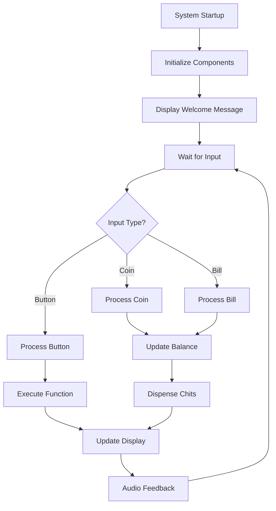

# 🎰 IoT Chits Exchanger

<div align="center">
  
  
  [](https://github.com/qppd/Chits-Exchanger/releases)
  [](https://opensource.org/licenses/MIT)
  [](https://www.espressif.com/en/products/socs/esp32)
  [](https://www.arduino.cc/)
</div>

## 📋 Table of Contents
- [Overview](#-overview)
- [Features](#-features)
- [Hardware Components](#-hardware-components)
- [System Architecture](#-system-architecture)
- [Pin Configuration](#-pin-configuration)
- [Software Architecture](#-software-architecture)
- [Installation](#-installation)
- [Usage](#-usage)
- [Hardware Setup](#-hardware-setup)
- [Development Progress](#-development-progress)
- [API Reference](#-api-reference)
- [Troubleshooting](#-troubleshooting)
- [Contributing](#-contributing)
- [License](#-license)
- [Contact & Support](#-contact--support)

## 🎯 Overview

The **IoT Chits Exchanger** is an intelligent, automated currency exchange system that seamlessly converts physical coins and bills into digital chits or tokens. Built on the robust ESP32 microcontroller platform, this system provides a complete solution for modern vending machines, arcade games, public transportation systems, and automated kiosks.

### 🔧 Core Functionality
- **Automated Currency Processing**: Real-time detection and validation of coins and bills
- **Smart Dispensing System**: Precise chit/token dispensing with servo-controlled mechanisms
- **Interactive User Interface**: 20x4 LCD display with tactile button controls
- **Audio Feedback**: Piezo buzzer for user interaction confirmation
- **Change Management**: Intelligent coin hopper for change dispensing
- **Real-time Monitoring**: Serial communication for system diagnostics and logging

### 🏆 Use Cases
- 🎮 **Arcade Machines**: Convert cash to game tokens
- 🚌 **Public Transportation**: Ticket vending systems
- 🏪 **Retail Kiosks**: Self-service payment processing
- 🎫 **Event Venues**: Ticket and voucher dispensing
- 🏛️ **Educational Institutions**: Campus card recharge stations

## ✨ Features

### 💰 Currency Input Systems
- **🪙 Advanced Coin Slot**
  - Interrupt-based detection with 50ms debounce logic
  - Support for multiple coin denominations
  - Anti-fraud pulse validation
  - Real-time coin counting and value calculation

- **💵 Professional Bill Acceptor**
  - TB74 pulse logic integration
  - 100ms debounce for reliable detection
  - Bill validation and authentication
  - Support for various bill denominations

### 🤖 Automated Dispensing
- **🎯 Servo-Controlled Chit Dispenser**
  - PCA9685 PWM driver for precise control
  - Configurable dispensing angles (0-180°)
  - Variable speed control for different chit types
  - Repeat dispensing capability

- **🔄 Intelligent Coin Hopper**
  - Motor-driven coin dispensing mechanism
  - Optical sensor for accurate coin counting
  - Configurable dispensing quantities
  - Jam detection and prevention

### 💻 User Interface
- **📺 20x4 I2C LCD Display**
  - Real-time transaction information
  - Multi-language support capability
  - Custom message display
  - System status indicators

- **🎮 Tactile Control Interface**
  - Debounced button inputs for reliability
  - LCD control button for menu navigation
  - Coin dispensing button for manual operations
  - Emergency stop functionality

### 🔊 Audio Feedback System
- **🔔 Piezo Buzzer Integration**
  - Configurable tone frequencies (1kHz for coins, 1.5kHz for bills)
  - Variable duration audio feedback
  - System status audio indicators
  - Error notification sounds

## 🔧 Hardware Components

<div align="center">

| Component | Model/Type | Quantity | Function |
|-----------|------------|----------|----------|
| **Microcontroller** | ESP32 DevKit | 1 | System brain and control unit |
| **Coin Slot** | Arcade Coin Acceptor | 1 | Physical coin detection |
| **Bill Acceptor** | TB74 Compatible | 1 | Bill validation and acceptance |
| **Servo Motor** | Standard 9g Servo | 1 | Chit dispensing mechanism |
| **PWM Driver** | PCA9685 16-Channel | 1 | Servo motor control |
| **LCD Display** | 20x4 I2C LCD | 1 | User interface display |
| **Coin Hopper** | Motorized Hopper | 1 | Change dispensing |
| **Tactile Buttons** | 12mm Push Buttons | 2 | User input controls |
| **Piezo Buzzer** | 5V Active Buzzer | 1 | Audio feedback |
| **Power Supply** | 5V/12V Dual Rail | 1 | System power |

</div>

### 📐 Physical Specifications
- **Operating Voltage**: 5V-12V DC
- **Power Consumption**: ~2A peak, ~500mA idle
- **Operating Temperature**: 0°C to 50°C
- **Humidity Range**: 10%-80% non-condensing
- **Dimensions**: Customizable based on enclosure

## 🏗️ System Architecture

### Wiring Diagram

<div align="center">
  
  <p><em>Complete wiring diagram showing all component connections</em></p>
</div>

### 📊 Connection Overview

The system follows a centralized architecture with the ESP32 as the main controller:

```
ESP32 Microcontroller (Central Hub)
├── 🪙 Coin Slot (GPIO 27) ────────── Interrupt-driven detection
├── 💵 Bill Acceptor (GPIO 26) ───── TB74 pulse logic
├── 🤖 PCA9685 PWM Driver (I2C) ──── Servo motor control
│   ├── SDA (GPIO 21)
│   └── SCL (GPIO 22)
├── 📺 20x4 LCD Display (I2C) ────── User interface
│   ├── SDA (GPIO 21)
│   └── SCL (GPIO 22)
├── 🎮 Control Buttons
│   ├── LCD Button (GPIO 8)
│   └── Coin Button (GPIO 9)
├── 🔄 Coin Hopper
│   ├── Motor (GPIO 10)
│   └── Sensor (GPIO 11)
└── 🔊 Piezo Buzzer (GPIO 12) ───── Audio feedback
```

### 🔌 Power Distribution
- **Main Power**: 12V DC for motors and high-power components
- **Logic Power**: 5V DC for ESP32 and sensors (via voltage regulator)
- **I2C Bus**: 3.3V logic level with pull-up resistors

## 📍 Pin Configuration

<div align="center">

| Component | GPIO Pin | Type | Description |
|-----------|----------|------|-------------|
| **Coin Slot** | 27 | Input (Pullup) | Coin detection interrupt |
| **Bill Acceptor** | 26 | Input (Pullup) | Bill acceptance interrupt |
| **I2C SDA** | 21 | I2C Data | LCD & PCA9685 data line |
| **I2C SCL** | 22 | I2C Clock | LCD & PCA9685 clock line |
| **LCD Button** | 8 | Input (Pullup) | LCD menu navigation |
| **Coin Button** | 9 | Input (Pullup) | Manual coin dispense |
| **Hopper Motor** | 10 | Output | Coin hopper motor control |
| **Hopper Sensor** | 11 | Input (Pullup) | Coin detection sensor |
| **Piezo Buzzer** | 12 | Output | Audio feedback |
| **Status LED** | 13 | Output | System status indicator |
| **Control Button** | 2 | Input | Main system control |

</div>

### ⚠️ Important Pin Notes
- **I2C Bus**: Shared between LCD and PCA9685 (requires different addresses)
- **Interrupt Pins**: GPIO 26 & 27 support external interrupts
- **Pull-up Resistors**: Required for all input pins (internal pull-ups enabled)
- **Power Pins**: Ensure adequate current capacity for motors

## 💻 Software Architecture

### 📁 File Structure
```
source/esp32/ChitExchanger/
├── 📄 ChitExchanger.ino          # Main application file
├── 🪙 COIN_SLOT.h/.cpp           # Coin detection system
├── 💵 BILL_ACCEPTOR.h/.cpp       # Bill acceptance system
├── 🤖 SERVO_DISPENSER.h/.cpp     # Servo control system
├── 📺 I2C_LCD.h/.cpp             # LCD display management
├── 🎮 TACTILE_BUTTON.h/.cpp      # Button input handling
├── 🔄 COIN_HOPPER.h/.cpp         # Coin dispensing system
├── 🔊 PIEZO_BUZZER.h/.cpp        # Audio feedback system
└── ⚙️ PIN_CONFIGURATION.h        # Centralized pin definitions
```

### 🔄 System Flow



### ⚡ Interrupt Service Routines (ISRs)

#### Coin Slot ISR
```cpp
void IRAM_ATTR ITRCOIN() {
    // 50ms debounce protection
    // Validates coin pulse signal
    // Sets coinInserted flag
}
```

#### Bill Acceptor ISR
```cpp
void IRAM_ATTR ITRBILL() {
    // 100ms debounce protection
    // TB74 pulse validation
    // Sets billAccepted flag
}
```

### 🎛️ Control Logic

#### Main Loop Operations
1. **Input Monitoring**: Continuous polling of interrupt flags
2. **Button Processing**: Debounced button state management
3. **Display Updates**: Real-time LCD message updates
4. **Servo Operations**: Precise chit dispensing control
5. **Audio Feedback**: Contextual sound generation
6. **Error Handling**: System fault detection and recovery

## 🚀 Installation

### 📋 Prerequisites

#### Software Requirements
- **Arduino IDE** 1.8.19 or later
- **ESP32 Board Package** 2.0.0 or later
- **Git** for repository cloning

#### Required Libraries
Install these libraries through Arduino Library Manager:

```bash
# Core Libraries
- Adafruit PWM Servo Driver Library (v2.4.0+)
- LiquidCrystal I2C Library (v1.1.2+)

# ESP32 Core Libraries (included with board package)
- Wire.h (I2C communication)
- Arduino.h (Core functions)
```

### 📥 Installation Steps

#### 1. Repository Setup
```bash
# Clone the repository
git clone https://github.com/qppd/Chits-Exchanger.git
cd Chits-Exchanger

# Navigate to source code
cd source/esp32/ChitExchanger
```

#### 2. Arduino IDE Configuration
1. Open Arduino IDE
2. Go to **File** > **Preferences**
3. Add ESP32 board manager URL:
   ```
   https://dl.espressif.com/dl/package_esp32_index.json
   ```
4. Go to **Tools** > **Board** > **Boards Manager**
5. Search and install "esp32" by Espressif Systems

#### 3. Library Installation
1. Open **Tools** > **Manage Libraries**
2. Search and install required libraries:
   - "Adafruit PWM Servo Driver"
   - "LiquidCrystal I2C"

#### 4. Board Configuration
1. Select **Tools** > **Board** > **ESP32 Arduino** > **ESP32 Dev Module**
2. Configure board settings:
   - **Upload Speed**: 921600
   - **CPU Frequency**: 240MHz (WiFi/BT)
   - **Flash Frequency**: 80MHz
   - **Flash Mode**: QIO
   - **Flash Size**: 4MB
   - **Partition Scheme**: Default 4MB

#### 5. Code Upload
1. Connect ESP32 to computer via USB
2. Select correct **Port** in **Tools** menu
3. Open `ChitExchanger.ino`
4. Click **Upload** button (or Ctrl+U)

## 🎮 Usage

### 🔧 Initial Setup

#### Power On Sequence
1. **Connect Power**: Ensure 5V/12V supply is connected
2. **System Boot**: ESP32 initializes (2-3 seconds)
3. **Component Check**: All peripherals are tested
4. **Welcome Display**: LCD shows "Welcome!" message

#### System Calibration
1. **Coin Slot Test**: Insert test coin to verify detection
2. **Bill Acceptor Test**: Insert test bill to verify acceptance
3. **Servo Test**: Observe chit dispensing mechanism
4. **Button Test**: Press both buttons to verify response
5. **Display Test**: Check LCD message clarity

### 💰 Operation Modes

#### Standard Operation
1. **Insert Currency**: Coin or bill into respective slots
2. **Value Recognition**: System calculates equivalent chits
3. **Confirmation**: Audio beep and LCD update
4. **Dispensing**: Automatic chit dispensing
5. **Change Return**: Coin hopper dispenses change if needed

#### Manual Mode (Button Control)
- **LCD Button**: Navigate through menu options
- **Coin Button**: Manual coin dispensing for testing
- **Emergency Stop**: Hold both buttons for 3 seconds

### 📊 Display Messages

| Message | Meaning | Action Required |
|---------|---------|-----------------|
| `Welcome!` | System ready | Insert currency |
| `Coin Detected` | Coin accepted | Processing... |
| `Bill Accepted` | Bill validated | Processing... |
| `Dispensing...` | Chits being dispensed | Wait for completion |
| `Change: X coins` | Change being returned | Collect coins |
| `Error: Contact Staff` | System malfunction | Technical assistance |

## 🔧 Hardware Setup

### 🛠️ Assembly Instructions

#### Step 1: ESP32 Preparation
1. Mount ESP32 on breadboard or custom PCB
2. Connect power supply (5V to VIN, GND to GND)
3. Verify power LED illumination

#### Step 2: I2C Bus Setup
1. Connect SDA (GPIO 21) to both LCD and PCA9685
2. Connect SCL (GPIO 22) to both LCD and PCA9685
3. Install 4.7kΩ pull-up resistors on both lines
4. Set unique I2C addresses (LCD: 0x27, PCA9685: 0x40)

#### Step 3: Input Devices
```
Coin Slot:
├── Signal wire → GPIO 27
├── VCC → 5V
└── GND → GND

Bill Acceptor:
├── Signal wire → GPIO 26
├── VCC → 12V
└── GND → GND
```

#### Step 4: Output Devices
```
Servo Motor (via PCA9685):
├── Signal → PCA9685 Channel 0
├── VCC → 5V
└── GND → GND

Coin Hopper:
├── Motor+ → GPIO 10 (via relay/driver)
├── Sensor → GPIO 11
└── GND → GND
```

#### Step 5: User Interface
```
20x4 LCD:
├── VCC → 5V
├── GND → GND
├── SDA → GPIO 21
└── SCL → GPIO 22

Buttons:
├── LCD Button: GPIO 8 → GND (with pullup)
├── Coin Button: GPIO 9 → GND (with pullup)
└── Control Button: GPIO 2 → GND (with pullup)

Piezo Buzzer:
├── Positive → GPIO 12
└── Negative → GND
```

### ⚡ Power Requirements

#### Voltage Rails
- **12V Rail**: Bill acceptor, coin hopper motor
- **5V Rail**: ESP32, LCD, servo motor, sensors
- **3.3V Rail**: I2C logic levels (internal ESP32 regulator)

#### Current Consumption
- **Idle State**: ~500mA total
- **Active Dispensing**: ~2A peak
- **Recommended PSU**: 12V/3A with 5V regulator

### 🔍 Testing Procedures

#### Component Testing
1. **Individual Module Test**: Test each component separately
2. **I2C Communication**: Verify LCD and PCA9685 responses
3. **Interrupt Testing**: Confirm coin/bill detection
4. **Servo Calibration**: Adjust angles for proper dispensing
5. **Integration Test**: Full system operation

#### Troubleshooting Checklist
- [ ] Power supply voltages correct
- [ ] All ground connections secure
- [ ] I2C pull-up resistors installed
- [ ] Pin configurations match code
- [ ] No short circuits present
- [ ] Component orientations correct

## 📊 Development Progress

### ✅ Completed Features

<div align="center">

| Component | Status | Features | Testing |
|-----------|---------|----------|---------|
| **🪙 Coin Slot** | ✅ Complete | Interrupt detection, 50ms debounce, pulse validation | ✅ Tested |
| **💵 Bill Acceptor** | ✅ Complete | TB74 integration, 100ms debounce, signal validation | ✅ Tested |
| **🤖 Servo Dispenser** | ✅ Complete | PCA9685 control, angle precision, speed control | ✅ Tested |
| **📺 LCD Display** | ✅ Complete | 20x4 I2C interface, message display, menu system | ✅ Tested |
| **🎮 Button Interface** | ✅ Complete | Debounced inputs, multi-function buttons | ✅ Tested |
| **🔄 Coin Hopper** | ✅ Complete | Motor control, sensor feedback, counting logic | ✅ Tested |
| **🔊 Audio System** | ✅ Complete | Piezo buzzer, tone generation, feedback system | ✅ Tested |
| **⚙️ Pin Management** | ✅ Complete | Centralized configuration, conflict prevention | ✅ Tested |

</div>

### 🔄 In Progress

- **🔗 System Integration**: Final testing of all components working together
- **⚡ Performance Optimization**: Code efficiency improvements and memory optimization
- **🛡️ Error Handling**: Enhanced fault detection and recovery mechanisms
- **📱 User Experience**: Interface refinements and usability improvements

### 🔮 Future Enhancements

#### Phase 1: Core Improvements
- [ ] **Database Integration**: Transaction logging and analytics
- [ ] **WiFi Connectivity**: Remote monitoring and control
- [ ] **RFID Support**: Card-based transactions
- [ ] **Multiple Currency**: Support for different denominations

#### Phase 2: Advanced Features
- [ ] **Web Dashboard**: Real-time monitoring interface
- [ ] **Mobile App**: Remote control and configuration
- [ ] **Receipt Printing**: Transaction receipts
- [ ] **Security Features**: Anti-tampering mechanisms

#### Phase 3: Enterprise Features
- [ ] **Network Integration**: Multi-device management
- [ ] **Analytics Dashboard**: Usage statistics and reporting
- [ ] **Maintenance Alerts**: Predictive maintenance notifications
- [ ] **API Integration**: Third-party service connections

## 📚 API Reference

### 🪙 Coin Slot Functions

```cpp
// Initialize coin slot with interrupt
void initALLANCOIN();

// Interrupt service routine for coin detection
void IRAM_ATTR ITRCOIN();

// Global variables
extern volatile bool coinInserted;          // Coin detection flag
extern volatile unsigned long coinLastDebounceTime;  // Debounce timing
extern const unsigned long coinDebounceDelay;       // 50ms debounce delay
```

### 💵 Bill Acceptor Functions

```cpp
// Initialize bill acceptor with interrupt
void initBILLACCEPTOR();

// Interrupt service routine for bill detection
void IRAM_ATTR ITRBILL();

// Global variables
extern volatile bool billAccepted;          // Bill acceptance flag
extern volatile unsigned long billLastDebounceTime; // Debounce timing
extern const unsigned long billDebounceDelay;       // 100ms debounce delay
```

### 🤖 Servo Dispenser Functions

```cpp
// Initialize PCA9685 and servo system
void initSERVO();

// Set servo to specific angle (0-180 degrees)
void setServoAngle(int channel, int angle);

// Operate servo with speed control
void operateSERVO(int channel, int startAngle, int endAngle, int speed);

// Repeat servo operation multiple times
void repeatOperateSERVO(int channel, int startAngle, int endAngle, int speed, int repeatCount);

// Constants
const int SERVO_MIN = 150;  // Minimum pulse length
const int SERVO_MAX = 600;  // Maximum pulse length
```

### 📺 LCD Display Functions

```cpp
// Initialize I2C LCD display
void initLCD();

// Display message on specific row (0-3)
void displayMessage(const char* message, int row);

// Clear entire display
void clearDisplay();

// Set cursor position
void setCursor(int col, int row);
```

### 🎮 Button Interface Functions

```cpp
// Set input flags based on button states
void setInputFlags();

// Process button actions
void resolveInputFlags();

// Handle specific button actions
void inputAction(int buttonIndex);

// Global variables
extern int inputState[numOfInputs];         // Current button states
extern int lastInputState[numOfInputs];     // Previous button states
extern bool inputFlags[numOfInputs];        // Button action flags
extern long lastDebounceTime[numOfInputs];  // Debounce timing
extern long debounceDelay;                  // 10ms debounce delay
```

### 🔄 Coin Hopper Functions

```cpp
// Initialize coin hopper motor and sensor
void initCoinHopper();

// Dispense specified number of coins
void dispenseCoins(int count);

// Pin definitions
#define HOPPER_MOTOR_PIN 10   // Motor control pin
#define HOPPER_SENSOR_PIN 11  // Coin detection sensor
```

### 🔊 Audio System Functions

```cpp
// Initialize piezo buzzer
void initBuzzer();

// Play tone with specified frequency and duration
void playTone(int frequency, int duration);

// Play predefined system sounds
void playStartupSound();
void playCoinSound();
void playBillSound();
void playErrorSound();

// Pin definition
#define BUZZER_PIN 12  // Buzzer control pin
```

## 🔧 Troubleshooting

### ⚠️ Common Issues

#### Power Issues
| Problem | Symptoms | Solution |
|---------|----------|----------|
| **Insufficient Power** | Components not responding, erratic behavior | Check power supply ratings (12V/3A minimum) |
| **Voltage Drop** | LCD dim, servo weak movement | Verify power connections, check voltage rails |
| **Ground Loops** | Noise, false triggers | Ensure single-point grounding |

#### Communication Issues
| Problem | Symptoms | Solution |
|---------|----------|----------|
| **I2C Conflicts** | LCD not updating, servo not responding | Check I2C addresses (LCD: 0x27, PCA9685: 0x40) |
| **Missing Pull-ups** | Intermittent I2C failures | Install 4.7kΩ pull-up resistors on SDA/SCL |
| **Bus Overload** | Slow response, timeouts | Reduce I2C clock speed, check wire lengths |

#### Sensor Issues
| Problem | Symptoms | Solution |
|---------|----------|----------|
| **False Coin Detection** | Multiple triggers from single coin | Adjust debounce delay, check sensor alignment |
| **Bill Not Detected** | Bills not recognized | Verify TB74 connections, check signal levels |
| **Hopper Jam** | Coins not dispensing | Clear mechanical obstruction, check motor voltage |

### 🔍 Debugging Steps

#### Serial Monitor Debugging
1. **Enable Serial Output**: Ensure `Serial.begin(9600)` in setup()
2. **Monitor Messages**: Watch for component initialization messages
3. **Check Interrupt Flags**: Monitor `coinInserted` and `billAccepted` flags
4. **Trace Execution**: Add debug prints in critical functions

#### Hardware Testing
1. **Multimeter Checks**: Verify voltage levels at each component
2. **Continuity Tests**: Check all connections for proper continuity
3. **Signal Analysis**: Use oscilloscope for interrupt signal validation
4. **Component Isolation**: Test each subsystem independently

#### Software Debugging
1. **Library Versions**: Ensure compatible library versions
2. **Memory Usage**: Check for memory leaks or stack overflow
3. **Timing Issues**: Verify interrupt priorities and timing
4. **Pin Conflicts**: Confirm no pin assignment conflicts

### 🆘 Emergency Procedures

#### System Reset
1. **Hardware Reset**: Press ESP32 reset button
2. **Software Reset**: Call `ESP.restart()` in code
3. **Factory Reset**: Re-upload firmware with default settings

#### Safe Shutdown
1. **Stop All Motors**: Immediately halt coin hopper and servo
2. **Clear Displays**: Turn off LCD backlight
3. **Disable Interrupts**: Detach all interrupt handlers
4. **Power Down**: Safely disconnect power supply

## 🤝 Contributing

We welcome contributions from the community! Here's how you can help improve the IoT Chits Exchanger project:

### 🚀 Getting Started

1. **Fork the Repository**
   ```bash
   git fork https://github.com/qppd/Chits-Exchanger.git
   ```

2. **Clone Your Fork**
   ```bash
   git clone https://github.com/yourusername/Chits-Exchanger.git
   cd Chits-Exchanger
   ```

3. **Create Feature Branch**
   ```bash
   git checkout -b feature/amazing-new-feature
   ```

4. **Make Your Changes**
   - Follow coding standards
   - Add comprehensive comments
   - Update documentation

5. **Test Thoroughly**
   - Test on actual hardware
   - Verify all components work
   - Run integration tests

6. **Submit Pull Request**
   - Provide detailed description
   - Include test results
   - Reference any related issues

### 📝 Contribution Guidelines

#### Code Standards
- **Indentation**: 2 spaces (no tabs)
- **Naming**: CamelCase for functions, UPPER_CASE for constants
- **Comments**: Comprehensive documentation for all functions
- **Error Handling**: Proper error checking and recovery

#### Documentation Requirements
- **Function Documentation**: All public functions must be documented
- **Pin Documentation**: Any pin changes must update PIN_CONFIGURATION.h
- **README Updates**: Update README for new features
- **Changelog**: Document all changes in version history

#### Testing Requirements
- **Hardware Testing**: All changes must be tested on physical hardware
- **Integration Testing**: Verify compatibility with existing features
- **Performance Testing**: Ensure no performance degradation
- **Documentation Testing**: Verify all instructions work correctly

### 🐛 Bug Reports

When reporting bugs, please include:

1. **System Information**
   - ESP32 board version
   - Arduino IDE version
   - Library versions
   - Hardware configuration

2. **Reproduction Steps**
   - Detailed step-by-step instructions
   - Expected vs actual behavior
   - Error messages or logs

3. **Additional Information**
   - Photos of hardware setup
   - Serial monitor output
   - Oscilloscope traces (if available)

### 💡 Feature Requests

For new feature suggestions:

1. **Use Case Description**: Explain the problem it solves
2. **Implementation Ideas**: Suggest how it could work
3. **Benefits**: Describe advantages for users
4. **Compatibility**: Consider impact on existing features

## 📄 License

This project is licensed under the **MIT License** - see the [LICENSE](LICENSE) file for details.

### MIT License Summary

```
Permission is hereby granted, free of charge, to any person obtaining a copy
of this software and associated documentation files (the "Software"), to deal
in the Software without restriction, including without limitation the rights
to use, copy, modify, merge, publish, distribute, sublicense, and/or sell
copies of the Software, and to permit persons to whom the Software is
furnished to do so, subject to the following conditions:

The above copyright notice and this permission notice shall be included in all
copies or substantial portions of the Software.
```

## 📞 Contact & Support

<div align="center">

### 👥 Development Team
**Quezon Province Developers**

---

### 📧 Contact Information

| Contact Method | Details |
|----------------|---------|
| **📧 Email** | [quezon.province.pd@gmail.com](mailto:quezon.province.pd@gmail.com) |
| **🐙 GitHub** | [github.com/qppd](https://github.com/qppd) |
| **🌐 Portfolio** | [sajed-mendoza.onrender.com](https://sajed-mendoza.onrender.com) |
| **📘 Facebook** | [facebook.com/qppd.dev](https://facebook.com/qppd.dev) |
| **📄 Facebook Page** | [facebook.com/QUEZONPROVINCEDEVS](https://facebook.com/QUEZONPROVINCEDEVS) |

---

### 🆘 Support Options

#### 🔧 Technical Support
- **GitHub Issues**: Report bugs and request features
- **Email Support**: Technical questions and troubleshooting
- **Community Forum**: Join discussions with other developers

#### 📚 Documentation
- **Wiki**: Comprehensive documentation and tutorials
- **API Reference**: Complete function and class documentation
- **Video Tutorials**: Step-by-step video guides

#### 🤝 Community
- **Discord Server**: Real-time chat and support
- **Facebook Group**: Community discussions and updates
- **YouTube Channel**: Project demonstrations and tutorials

---

### 🌟 Acknowledgments

Special thanks to:
- **Arduino Community** for the excellent development platform
- **Adafruit** for the PWM servo driver library
- **LiquidCrystal_I2C** library contributors
- **ESP32 Community** for hardware support and documentation
- **Beta Testers** who helped refine the system

---

### 📈 Project Statistics

[](https://github.com/qppd/Chits-Exchanger/stargazers)
[](https://github.com/qppd/Chits-Exchanger/network)
[](https://github.com/qppd/Chits-Exchanger/issues)
[](https://github.com/qppd/Chits-Exchanger/blob/main/LICENSE)

</div>

---

<div align="center">
  <h3>🎯 Made with ❤️ by Quezon Province Developers</h3>
  <p><em>Empowering automation through innovative IoT solutions</em></p>
  
  **⭐ If you found this project helpful, please give it a star! ⭐**
</div>
